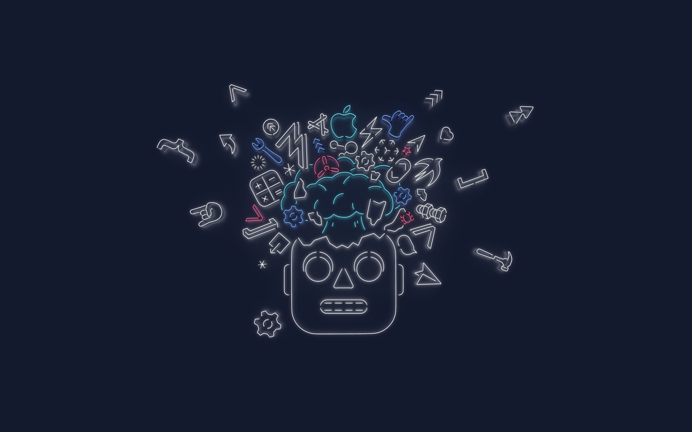

# dotfiles
Configuration I3 et Polybar sur Ubuntu

## Config
Ajouter le dossier config dans votre $HOME/.config/ selon leur emplacement correct.

### Installer les Packages
#### sur Arch-linux (le gestionnaire de package de decoffrage AUR) ou avefc votre terminal :
sudo apt install nom_du_package
  * i3 / i3-gaps
  	- [i3-gaps](https://github.com/Airblader/i3) suivre le wiki [i3-gaps wiki](https://github.com/Airblader/i3/wiki). Installer les dépendances requises.
  * polybar
  	- [polybar](https://github.com/polybar/polybar) suivre le wiki [polybar wiki](https://github.com/polybar/polybar/wiki).
Installer les dépendances requises et aussi les dépendances facultatives afin d'avoir pour les modules volume, network.
  * rofi
  * compton
  * rxvt-unicode / rxvt-unicode-color256
  * fish 
  	- [Oh my fish](https://github.com/oh-my-fish/oh-my-fish) Pour la configuration de fish avec les differents theme, executer cette commande:  ``chsh -s /usr/bin/fish`` pour que fish soit la console par defaut.
  * zsh
  - [Oh my zsh](https://github.com/robbyrussell/oh-my-zsh) Pour finaliser l'installation de zsh <br Attention pendant l'installation de zsh en executant cette commande : ``sh -c "$(curl -fsSL https://raw.githubusercontent.com/robbyrussell/oh-my-zsh/master/tools/install.sh)"`` via curl ou ``sh -c "$(wget -O- https://raw.githubusercontent.com/robbyrussell/oh-my-zsh/master/tools/install.sh)"`` via wget, zsh pourrait s'installer comme console par defaut si vous tapez sur Entrée sans lire la question.
  * Vim
  * Visual Code Insiders
  * IDEA IntelliJ Ultimate
  
  ## Wallpaper
  
